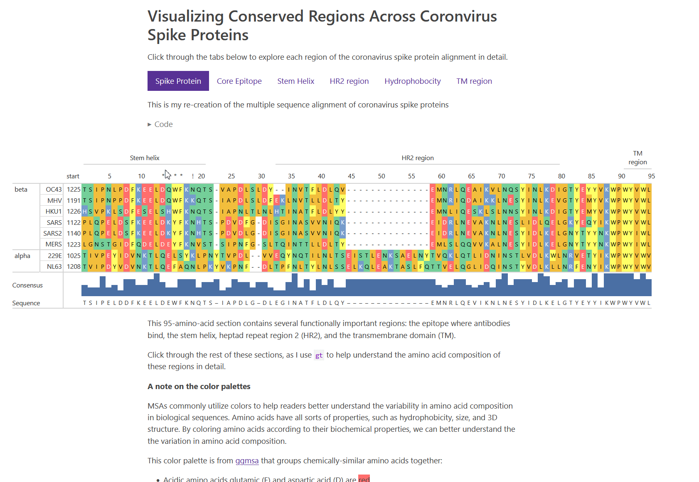

# Multiple Sequence Alignments with r-gt

This submission to the 2025 table contest explores using the r package `gt` to explore the composition of coronavirus spike proteins. 

[Table](https://victoryuan.com/2025-posit-table-contest-gt-msa/)

The data is from *Wang 2021.*

Wang, C., van Haperen, R., Gutiérrez-Álvarez, J. et al. A conserved immunogenic and vulnerable site on the coronavirus spike protein delineated by cross-reactive monoclonal antibodies. Nat Commun 12, 1715 (2021). https://doi.org/10.1038/s41467-021-21968-w